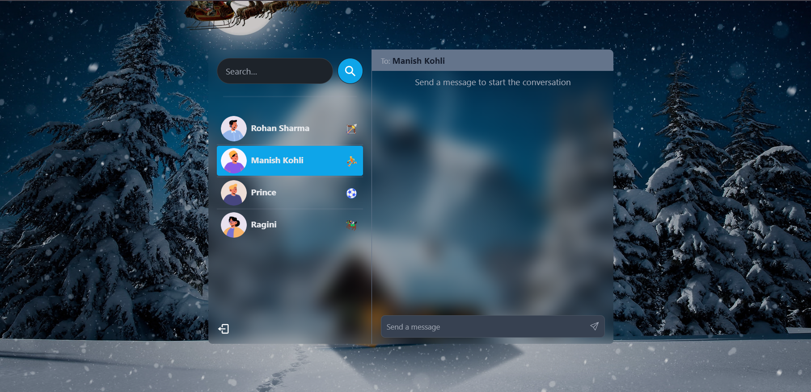

# MERN Stack Chatting Application

Welcome to the MERN Stack Chatting Application! This project is a real-time chat application built using the MERN (MongoDB, Express.js, React, Node.js) stack, along with Socket.io for real-time communication, JWT for authentication, Tailwind CSS for styling, and Daisy UI for UI components.


### Demo Screeshots




## Features

- Real-time messaging with Socket.io
- User authentication using JWT (JSON Web Tokens)
- Responsive design with Tailwind CSS and Daisy UI
- Persistent chat history with MongoDB
- User-friendly interface

## Technologies Used

- **MongoDB**: Database for storing user information and chat history.
- **Express.js**: Web framework for Node.js to build the REST API.
- **React**: Frontend library for building user interfaces.
- **Node.js**: JavaScript runtime for server-side development.
- **Socket.io**: Library for real-time web applications.
- **JWT**: Secure token-based authentication.
- **Tailwind CSS**: Utility-first CSS framework for styling.
- **Daisy UI**: Component library built on Tailwind CSS.
- **Other Dependencies**: Various npm packages for additional functionalities.


## Usage

1. **Register an account**.
2. **Log in** with your credentials.
3. **Start chatting** with other users in real-time!

## Project Structure

```bash
mern-chat-app/
├── client/          # React frontend
│   ├── public/      # Public assets
│   └── src/         # Source code
├── server/          # Node.js backend
│   ├── config/      # Configuration files
│   ├── controllers/ # API controllers
│   ├── models/      # Mongoose models
│   ├── routes/      # API routes
│   └── sockets/     # Socket.io setup
├── .gitignore       # Git ignore file
├── README.md        # Project documentation
└── package.json     # Project dependencies
